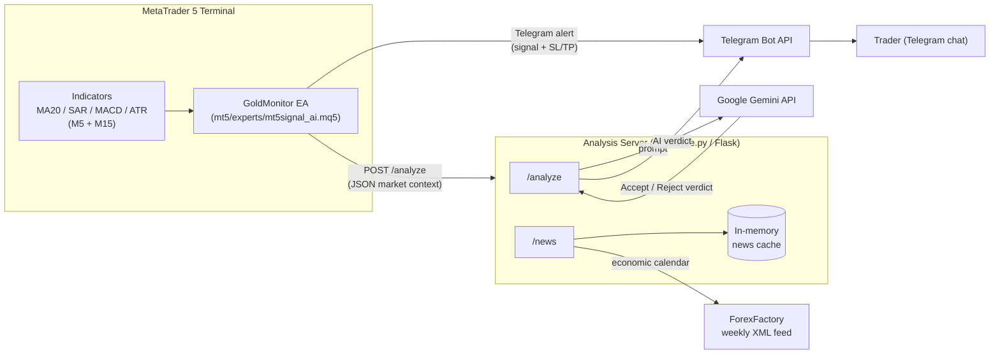

# MT5 AI Trading Signal System

An MT5 Expert Advisor that detects XAUUSD (Gold) M5 reversal signals (SAR flip + MA20 + MACD confirmation), pushes alerts to Telegram, and forwards enriched market context to a Python/Flask service that asks Google Gemini for a second opinion before the trade is acted on manually.

> **Note:** This EA is a *signal generator*, not an auto-trader — it never calls `OrderSend()`. Execution is manual, based on the Telegram alert and the AI's accept/reject verdict.

## Architecture



## Features

- **Multi-timeframe signal detection** — Parabolic SAR flip + MA20 trend filter on M5, with MACD momentum confirmation on M5 and M15.
- **Duplicate-signal guard** — tracks the last fired signal direction and the candle a SAR flip occurred on, to avoid repeat alerts within the same setup.
- **Sideway/ranging filter** — flags choppy conditions using 20-candle range and MA20 slope so weak setups are labeled accordingly.
- **Fixed 1:1 risk/reward SL & TP** — computed off the current SAR value with a pip buffer, with a minimum SL distance guard.
- **Telegram alerts** — bilingual (Chinese/English emoji-formatted) messages with session context (Tokyo/London/New York/overlaps).
- **AI second-opinion layer** — enriched market context (last 50 candles, candle body/wick %, breakout/wick-rejection counts, support/resistance) is sent to Gemini, which returns an accept/reject verdict, confidence, and risk note.
- **Economic news calendar** — `/news` endpoint pulls and caches USD high/medium-impact events from ForexFactory.
- **Backtest-safe** — all Telegram/HTTP calls are skipped automatically inside the MT5 Strategy Tester (`MQLInfoInteger(MQL_TESTER)`).

## Tech Stack

| Layer | Technology |
| :--- | :--- |
| Trading platform | MetaTrader 5 (MQL5 Expert Advisor) |
| Analysis service | Python 3, Flask |
| AI model | Google Gemini (`gemini-2.5-flash` via `google-genai`) |
| Database | MySQL 8.0 |
| ORM / migrations | SQLAlchemy 2.0 + Alembic |
| Notifications | Telegram Bot API |
| News data | ForexFactory weekly XML calendar |

## System Architecture

- **MT5 EA** (`mt5/experts/mt5signal_ai.mq5`) — runs on every tick, maintains indicator handles created once in `OnInit()`, computes M5/M15 indicator values via `CopyBuffer()`, and evaluates entry conditions.
- **Analysis server** (`ai/analyze.py`) — a single Flask process exposing `/analyze` (receives EA signals, builds an LLM prompt, calls Gemini, relays the verdict to Telegram) and `/news` (ForexFactory calendar, TTL-cached in memory).
- **Telegram** acts as the UI — both the raw signal alert and the AI's accept/reject verdict land in the same chat, and the trader executes manually in MT5.
- There is currently a single deployment target: the EA is configured to call the analysis server directly at a fixed LAN address/port (see [Configuration](#configuration)).

## Order Flow

No orders are placed automatically. The flow per tick is:

1. Read M5/M15 indicator buffers (MA20, SAR, MACD, ATR) and price.
2. Check for a fresh SAR flip aligned with MA20 trend on M5 (`m5Buy` / `m5Sell`).
3. If a new signal (different from `lastSignalType`) and the SL distance passes the minimum-distance guard, compute SL/TP (1:1 R:R).
4. Send the Telegram alert immediately.
5. Load the fuller `MarketContext` (last 50 candles, candle stats) and POST it to `/analyze`.
6. The trader receives both the raw signal and, moments later, the Gemini-generated accept/reject verdict, and decides whether to place the trade manually.

## Kafka Event Flow

Not used in this project. There is no message broker — the EA talks to the analysis server directly over HTTP (`WebRequest` → Flask), and results are relayed back to the user via the Telegram Bot API rather than an event stream.

## Database Design

Signals, their indicator snapshots, the AI verdict, and (eventually) the trade outcome are persisted to **MySQL** so a future report engine can compute real win rates instead of relying on memory/Telegram scrollback. The ForexFactory news cache stays in-memory only (unchanged) — nothing about `/news` touches the database.

Schema (managed by Alembic — see [Database Setup](#database-setup)):

| Table | Purpose |
| :--- | :--- |
| `strategy` | One row per EA/strategy version (`name`, `version`, `enabled`) that signals are attributed to. Seeded with the current `GoldMonitor` v2.10 EA. |
| `signal` | One row per fired signal — symbol, fire time, the signal candle's open time, session, type (BUY/SELL), price/SL/TP/RR/spread. FK → `strategy`. |
| `signal_indicator` | One row per (signal, timeframe) — MA20/SAR/MACD hit flags for that timeframe (M5, M15). FK → `signal`. |
| `ai_analysis` | Gemini's verdict for a signal — decision, confidence, risk note, comment, and the raw model response for audit. FK → `signal`. |
| `signal_outcome` | Populated later by a batch job that walks MT5 history forward from the signal's candle to determine whether TP or SL hit first (`TP_HIT`/`SL_HIT`/`EXPIRED`/`OPEN`), plus exit price/time and P&L. FK → `signal`, one row max per signal. This is what makes win-rate reporting possible. |

**Not yet wired up:** `ai/analyze.py`'s `/analyze` handler doesn't write to these tables yet (it only calls Gemini/Telegram today) — see [Future Improvements](#future-improvements).

## Project Structure

```
MT5 Sys/
├── README.md
├── requirements.txt              # Python deps: flask, requests, google-genai, PyMySQL, SQLAlchemy, alembic, python-dotenv
├── .env.example                  # Template for required env vars (Telegram/Gemini/DB) — copy to .env, never commit real values
├── .gitignore
├── alembic.ini                   # Alembic config — points at ai/migrations, DB URL is set at runtime from .env (never hardcoded here)
│
├── mt5/
│   └── experts/
│       └── mt5signal_ai.mq5      # MT5 Expert Advisor (signal detection + Telegram/AI dispatch)
│
├── deploy/
│   └── mysql/
│       └── create_database.sql  # One-time provisioning script: creates the mt5_signals DB + a dedicated mt5_app MySQL user (run once as root)
│
└── ai/
    ├── analyze.py                # Flask service: /analyze (Gemini verdict) and /news (ForexFactory calendar)
    ├── models.py                 # SQLAlchemy declarative models — one class per table (Strategy, Signal, SignalIndicator, AiAnalysis, SignalOutcome) + the engine/session factory
    ├── db.py                     # Thin data-access layer used by analyze.py — get_session() plus insert_signal/insert_signal_indicator/insert_ai_analysis/insert_signal_outcome
    └── migrations/
        ├── env.py                # Alembic runtime — loads DB credentials from .env via ai/models.py and points Alembic at the SQLAlchemy models
        ├── script.py.mako        # Template Alembic fills in when you run `alembic revision --autogenerate`
        └── versions/
            └── 0001_initial_schema.py  # Creates all 5 tables + seeds the GoldMonitor v2.10 strategy row
```

## Prerequisites

- MetaTrader 5 terminal with **Algo Trading** enabled.
- MT5 **Tools → Options → Expert Advisors** — the analysis server's URL and `https://api.telegram.org` must be added to the allowed **WebRequest** URL list, or all HTTP calls will silently fail.
- Python 3.10+ with dependencies from `requirements.txt` (`flask`, `requests`, `google-genai`, `PyMySQL`, `SQLAlchemy`, `alembic`, `python-dotenv`).
- **MySQL Server 8.0** running locally (or reachable over the network) — see [Database Setup](#database-setup).
- A Telegram bot token and chat ID (create a bot via [@BotFather](https://t.me/BotFather)).
- A Google Gemini API key.

## Database Setup

Run this once before starting the analysis server for the first time.

1. **Create the database and a dedicated MySQL user** — edit `deploy/mysql/create_database.sql` (replace `CHANGE_ME_STRONG_PASSWORD` with a real password), then run it as root:
   ```cmd
   "C:\Program Files\MySQL\MySQL Server 8.0\bin\mysql.exe" -u root -p < "deploy\mysql\create_database.sql"
   ```
   This creates a `mt5_signals` database and an `mt5_app` user scoped to only that database — the app never connects as `root`.

2. **Set up the Python environment and `.env`**
   ```bash
   python -m venv venv
   venv\Scripts\activate        # Windows; use `source venv/bin/activate` on macOS/Linux
   pip install -r requirements.txt
   copy .env.example .env      # then fill in real values — never edit .env.example itself
   ```
   In `.env`, set `DB_HOST`, `DB_PORT`, `DB_USER`, `DB_PASSWORD`, `DB_NAME` to match what you created in step 1 (e.g. `DB_USER=mt5_app`, `DB_NAME=mt5_signals`).

3. **Run the migration** — creates all 5 tables plus the seed `strategy` row:
   ```bash
   alembic upgrade head
   ```
   Whenever `ai/models.py` changes later, generate and apply a new migration instead of hand-editing the database:
   ```bash
   alembic revision --autogenerate -m "describe the change"
   alembic upgrade head
   ```

## Getting Started

1. **Run the analysis server** (after completing [Database Setup](#database-setup) and activating the venv)
   ```bash
   python ai/analyze.py
   ```
   `.env` is loaded automatically via `python-dotenv` — no manual `export` needed. The server listens on `0.0.0.0:5000`.

2. **Install the EA**
   - Copy `mt5/experts/mt5signal_ai.mq5` into your MT5 `MQL5/Experts` folder.
   - Compile it in MetaEditor.
   - Attach it to an XAUUSD chart (M5) and fill in `InpBotToken`, `InpChatId`, and `InpAiServerBaseUrl` in the EA's **Inputs** tab.

3. **Whitelist URLs** in MT5 (see [Prerequisites](#prerequisites)) so `WebRequest` calls to Telegram and the analysis server succeed.

4. Watch the configured Telegram chat for signal alerts and the AI's follow-up verdict.

## Configuration

No secrets are hardcoded in source. Set them via EA inputs (MQL5) and environment variables (Python) before running.

**`mt5/experts/mt5signal_ai.mq5`** — set as EA **input parameters** when attaching to a chart:
| Input | Purpose |
|---|---|
| `InpBotToken` | Telegram bot token |
| `InpChatId` | Telegram chat/channel to post signals to |
| `InpAiServerBaseUrl` | Analysis server base URL, trailing slash required (default `http://127.0.0.1:5000/` — change to your own deployment; the EA appends `analyze` / `news?send_telegram=1`) |
| `InpLiveMode` | `true` = send real Telegram/AI HTTP calls, `false` = log only (Experts log), no network calls |

`InpBotToken` and `InpChatId` default to empty strings — the EA won't send Telegram messages until you fill them in.

**`ai/analyze.py` / `ai/models.py`** — read from environment variables, auto-loaded from `.env` via `python-dotenv` (see `.env.example`):
| Variable | Purpose |
|---|---|
| `TELEGRAM_BOT_TOKEN` / `TELEGRAM_CHAT_ID` / `TELEGRAM_CHAT_ID_TESTING` | Telegram credentials |
| `GEMINI_API_KEY` | Gemini API key |
| `DB_HOST` / `DB_PORT` / `DB_USER` / `DB_PASSWORD` / `DB_NAME` | MySQL connection (see [Database Setup](#database-setup)) |

Both `ai/analyze.py` and `ai/models.py` raise `RuntimeError` at import time if any of their required variables are missing — this is intentional fail-fast behavior, not a bug, so a misconfigured deployment can't silently run half-broken.

⚠️ **Never put real values in `.env.example`** — only in `.env` (gitignored). If a real secret ever ends up committed or pasted somewhere it shouldn't be, treat it as compromised and rotate it immediately (regenerate the Telegram bot token via [@BotFather](https://t.me/BotFather), issue a new Gemini API key, and change the MySQL user's password via `ALTER USER`).

## API Documentation

### `POST /analyze`
Consumed by the EA after a signal fires. Body (JSON):

```json
{
  "symbol": "XAUUSD", "timeframe": "M5", "time": "...", "signal": "BUY",
  "price": 0, "sl": 0, "tp": 0, "pips": 0, "spread": 0, "volatility": 0,
  "market_regime": "Sideway|Not Sideway", "session": "...",
  "m5":  { "ma20": 0, "sar": 0, "macd_main": 0, "macd_sig": 0, "macd_bull": true },
  "m15": { "ma20": 0, "sar": 0, "macd_main": 0, "macd_sig": 0, "macd_bull": true },
  "support_resistance": { "nearest_high": 0, "nearest_low": 0, "dist_to_high": 0, "dist_to_low": 0 },
  "current_candle":  { "open": 0, "high": 0, "low": 0, "close": 0, "body_pct": 0, "wick_pct": 0 },
  "previous_candle": { "open": 0, "high": 0, "low": 0, "close": 0, "body_pct": 0, "wick_pct": 0 },
  "last_50_candles": { "hh_hl_count": 0, "lh_ll_count": 0, "range_high": 0, "range_low": 0, "range_size": 0, "atr_estimate": 0, "big_candles": 0, "breakouts": 0, "wick_rejections": 0 }
}
```
Response: `{"status": "ok"}` (Gemini's 接受/拒绝 verdict is sent to Telegram, not returned in the HTTP response). Errors still respond `200` with `{"status": "error", ...}` so the EA doesn't log an HTTP failure.

### `GET /news`
Query params: `send_telegram=1` (optional) — also pushes the week's summary to Telegram.

Response:
```json
{ "status": "ok", "fetched_at": "...", "count": 0, "events": [ { "title": "...", "impact": "High|Medium", "date": "...", "time": "...", "forecast": "...", "previous": "..." } ] }
```
Backed by an hourly in-memory cache of the ForexFactory weekly XML calendar, filtered to USD High/Medium-impact events.

## Testing

- The EA checks `MQLInfoInteger(MQL_TESTER)` and skips all Telegram/HTTP calls in the MT5 **Strategy Tester**, printing to the Experts log instead — so strategy logic can be backtested without hitting live endpoints.
- There is no automated test suite for `ai/analyze.py` yet. Recommended next step: unit tests around the ForexFactory XML parsing (`_fetch_ff_xml`) and prompt formatting, and an integration test that stubs the Gemini client.

## Reliability & Error Handling

- **Telegram/Gemini calls never crash the request.** All outbound Telegram calls go through a single `_send_telegram()` helper with an explicit timeout (`HTTP_TIMEOUT = 10s`) that catches `requests.RequestException`, logs, and returns `False` instead of raising — so a Telegram outage can't take down `/analyze` or `/news`.
- **Gemini retry logic matches the actual SDK.** `call_gemini_with_retry()` retries on `google.genai.errors.ClientError` with `code == 429` (rate limit, exponential backoff) and on `ServerError` (transient 5xx), and re-raises immediately on anything else instead of retrying blindly.
- **Malformed input is rejected, not crashed on.** `/analyze` validates the JSON body with `request.get_json(silent=True)` and defaults every nested section (`m5`, `m15`, `support_resistance`, candle dicts) to `{}` so a partial or malformed EA payload can't raise an `AttributeError` mid-request.
- **Structured logging instead of `print`.** All server-side diagnostics go through the standard `logging` module (timestamped, leveled) rather than `print`, and unexpected exceptions are logged with full tracebacks via `logger.exception(...)`.
- **A global Flask error handler** catches anything unhandled and always returns `200 {"status": "error", ...}` rather than leaking a bare 500/stack trace to the EA, consistent with the "EA shouldn't log an HTTP failure" contract used elsewhere in `/analyze`.
- **MT5 EA side:** `OnInit()` now validates *every* indicator handle (including `handleMA20_M15` and `handleATR_M5`, previously unchecked) against `INVALID_HANDLE` before proceeding, and `WebRequest` failures in `SendTelegram()`/`SendToExtForAI()` are logged with `GetLastError()` and the HTTP status rather than assumed to succeed.

## Design Decisions

- **Manual execution over auto-trading** — the EA only signals and asks Gemini for a sanity check; the human stays in the loop for order placement.
- **Fixed 1:1 risk/reward** — SL and TP are always equidistant from entry, computed from the current SAR value plus a pip buffer, simplifying position sizing.
- **AI as a secondary filter, not a gate** — the Telegram alert and `/analyze` call both fire once M5 conditions are met; the M15 SAR/MACD marks shown in the alert are informational context passed to Gemini rather than a hard entry filter in the EA itself.
- **Live-mode kill switch** — `InpLiveMode` is a runtime `input bool` checked with a plain `if`, not a preprocessor `#ifdef`. (An earlier version used `#define LIVE_MODE true` + `#ifdef LIVE_MODE`, which is always true regardless of the macro's value since `#ifdef` only tests whether a macro is defined — that toggle never actually worked.)

## Future Improvements

- Decide whether M15 SAR/MACD alignment should be an enforced entry filter, not just a display label.
- **Wire `/analyze` to the database** — it currently only calls Gemini/Telegram; it needs to also call `insert_signal`/`insert_signal_indicator`/`insert_ai_analysis` from `ai/db.py` so incoming EA signals actually get persisted.
- **Build the outcome evaluator** — a batch script (e.g. `ai/evaluate_outcomes.py`) that walks MT5 history forward from each un-evaluated signal's `signal_bar_time` to determine TP/SL hit, writing `signal_outcome` rows via `insert_signal_outcome`.
- **Build the report engine** — queries joining `signal` + `signal_outcome` + `ai_analysis` to compute win rate, profit factor, and expectancy, broken down by strategy/session/signal type/AI decision.
- **Production hosting on Windows Server** — run behind **Waitress** (production WSGI server; Flask's dev server and gunicorn aren't suitable on Windows) wrapped as a Windows Service via **NSSM**, with log rotation and a `/health` endpoint.
- Containerize `ai/analyze.py` (Docker) for easier deployment instead of a fixed LAN IP.
- Add automated tests for the Flask service and a way to dry-run the EA's message formatting.

## License

MIT — see [LICENSE](LICENSE).
