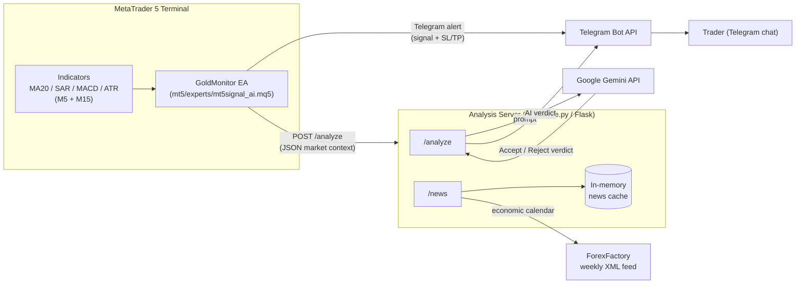

# MT5 AI Trading Signal System

An MT5 Expert Advisor that detects XAUUSD (Gold) M5 reversal signals (SAR flip + MA20 + MACD confirmation), pushes alerts to Telegram, and forwards enriched market context to a Python/Flask service that asks Google Gemini for a second opinion before the trade is acted on manually.

> **Note:** This EA is a *signal generator*, not an auto-trader — it never calls `OrderSend()`. Execution is manual, based on the Telegram alert and the AI's accept/reject verdict.

## Architecture



## Features

- **Multi-timeframe signal detection** — Parabolic SAR flip + MA20 trend filter on M5, with MACD momentum confirmation on M5 and M15.
- **Duplicate-signal guard** — tracks the last fired signal direction and the candle a SAR flip occurred on, to avoid repeat alerts within the same setup.
- **Sideway/ranging filter** — flags choppy conditions using 20-candle range and MA20 slope so weak setups are labeled accordingly.
- **Fixed 1:1 risk/reward SL & TP** — computed off the current SAR value with a pip buffer, with a minimum SL distance guard.
- **Telegram alerts** — bilingual (Chinese/English emoji-formatted) messages with session context (Tokyo/London/New York/overlaps).
- **AI second-opinion layer** — enriched market context (last 50 candles, candle body/wick %, breakout/wick-rejection counts, support/resistance) is sent to Gemini, which returns an accept/reject verdict, confidence, and risk note.
- **Economic news calendar** — `/news` endpoint pulls and caches USD high/medium-impact events from ForexFactory.
- **Backtest-safe** — all Telegram/HTTP calls are skipped automatically inside the MT5 Strategy Tester (`MQLInfoInteger(MQL_TESTER)`).

## Tech Stack

| Layer | Technology |
| :--- | :--- |
| Trading platform | MetaTrader 5 (MQL5 Expert Advisor) |
| Analysis service | Python 3, Flask |
| AI model | Google Gemini (`gemini-2.5-flash` via `google-genai`) |
| Notifications | Telegram Bot API |
| News data | ForexFactory weekly XML calendar |

## System Architecture

- **MT5 EA** (`mt5/experts/mt5signal_ai.mq5`) — runs on every tick, maintains indicator handles created once in `OnInit()`, computes M5/M15 indicator values via `CopyBuffer()`, and evaluates entry conditions.
- **Analysis server** (`ai/analyze.py`) — a single Flask process exposing `/analyze` (receives EA signals, builds an LLM prompt, calls Gemini, relays the verdict to Telegram) and `/news` (ForexFactory calendar, TTL-cached in memory).
- **Telegram** acts as the UI — both the raw signal alert and the AI's accept/reject verdict land in the same chat, and the trader executes manually in MT5.
- There is currently a single deployment target: the EA is configured to call the analysis server directly at a fixed LAN address/port (see [Configuration](#configuration)).

## Order Flow

No orders are placed automatically. The flow per tick is:

1. Read M5/M15 indicator buffers (MA20, SAR, MACD, ATR) and price.
2. Check for a fresh SAR flip aligned with MA20 trend on M5 (`m5Buy` / `m5Sell`).
3. If a new signal (different from `lastSignalType`) and the SL distance passes the minimum-distance guard, compute SL/TP (1:1 R:R).
4. Send the Telegram alert immediately.
5. Load the fuller `MarketContext` (last 50 candles, candle stats) and POST it to `/analyze`.
6. The trader receives both the raw signal and, moments later, the Gemini-generated accept/reject verdict, and decides whether to place the trade manually.

## Kafka Event Flow

Not used in this project. There is no message broker — the EA talks to the analysis server directly over HTTP (`WebRequest` → Flask), and results are relayed back to the user via the Telegram Bot API rather than an event stream.

## Database Design

Not used in this project. There is no persistent database:

- The EA's `MarketContext` struct exists only in memory for the duration of a signal.
- The analysis server keeps a single in-memory, TTL-based cache (`_news_cache`) for the ForexFactory calendar; nothing is written to disk.

If trade history/analytics tracking is needed later, see [Future Improvements](#future-improvements).

## Project Structure

```
MT5 Sys/
├── README.md
├── requirements.txt            # Python deps for ai/analyze.py
├── .env.example                # Template for the analysis server's required env vars
├── .gitignore
│
├── mt5/
│   └── experts/
│       └── mt5signal_ai.mq5    # MT5 Expert Advisor (signal detection + Telegram/AI dispatch)
│
└── ai/
    └── analyze.py              # Flask service: /analyze (Gemini verdict) and /news (ForexFactory calendar)
```

## Prerequisites

- MetaTrader 5 terminal with **Algo Trading** enabled.
- MT5 **Tools → Options → Expert Advisors** — the analysis server's URL and `https://api.telegram.org` must be added to the allowed **WebRequest** URL list, or all HTTP calls will silently fail.
- Python 3.10+ with dependencies from `requirements.txt` (`flask`, `requests`, `google-genai`).
- A Telegram bot token and chat ID (create a bot via [@BotFather](https://t.me/BotFather)).
- A Google Gemini API key.

## Getting Started

1. **Run the analysis server**
   ```bash
   pip install -r requirements.txt
   cp .env.example .env   # then fill in real values
   export $(grep -v '^#' .env | xargs)   # or use a tool like python-dotenv/direnv
   python ai/analyze.py
   ```
   The server listens on `0.0.0.0:5000`.

2. **Install the EA**
   - Copy `mt5/experts/mt5signal_ai.mq5` into your MT5 `MQL5/Experts` folder.
   - Compile it in MetaEditor.
   - Attach it to an XAUUSD chart (M5) and fill in `InpBotToken`, `InpChatId`, `InpChatIdTesting`, and `InpAiServerUrl` in the EA's **Inputs** tab.

3. **Whitelist URLs** in MT5 (see [Prerequisites](#prerequisites)) so `WebRequest` calls to Telegram and the analysis server succeed.

4. Watch the configured Telegram chat for signal alerts and the AI's follow-up verdict.

## Configuration

No secrets are hardcoded in source. Set them via EA inputs (MQL5) and environment variables (Python) before running.

**`mt5/experts/mt5signal_ai.mq5`** — set as EA **input parameters** when attaching to a chart:
| Input | Purpose |
|---|---|
| `InpBotToken` | Telegram bot token |
| `InpChatId` | Telegram chat/channel to post signals to |
| `InpChatIdTesting` | Alternate chat ID reserved for testing |
| `InpAiServerUrl` | Analysis server address (default `http://192.168.1.13:5000/analyze` — change to your own deployment) |
| `InpLiveMode` | `true` = send real Telegram/AI HTTP calls, `false` = log only (Experts log), no network calls |

`InpBotToken`, `InpChatId`, and `InpChatIdTesting` default to empty strings — the EA won't send Telegram messages until you fill them in.

**`ai/analyze.py`** — set as environment variables before starting the server (see `.env.example`):
| Variable | Purpose |
|---|---|
| `TELEGRAM_BOT_TOKEN` / `TELEGRAM_CHAT_ID` / `TELEGRAM_CHAT_ID_TESTING` | Telegram credentials |
| `GEMINI_API_KEY` | Gemini API key |

The server raises `RuntimeError` at startup if any of these are missing, e.g.:
```bash
export TELEGRAM_BOT_TOKEN="..."
export TELEGRAM_CHAT_ID="..."
export TELEGRAM_CHAT_ID_TESTING="..."
export GEMINI_API_KEY="..."
python ai/analyze.py
```

⚠️ The token and key that were previously hardcoded in this repo's history should be considered compromised — rotate them (regenerate the Telegram bot token via [@BotFather](https://t.me/BotFather) and issue a new Gemini API key) rather than reusing the old values.

## API Documentation

### `POST /analyze`
Consumed by the EA after a signal fires. Body (JSON):

```json
{
  "symbol": "XAUUSD", "timeframe": "M5", "time": "...", "signal": "BUY",
  "price": 0, "sl": 0, "tp": 0, "pips": 0, "spread": 0, "volatility": 0,
  "market_regime": "Sideway|Not Sideway", "session": "...",
  "m5":  { "ma20": 0, "sar": 0, "macd_main": 0, "macd_sig": 0, "macd_bull": true },
  "m15": { "ma20": 0, "sar": 0, "macd_main": 0, "macd_sig": 0, "macd_bull": true },
  "support_resistance": { "nearest_high": 0, "nearest_low": 0, "dist_to_high": 0, "dist_to_low": 0 },
  "current_candle":  { "open": 0, "high": 0, "low": 0, "close": 0, "body_pct": 0, "wick_pct": 0 },
  "previous_candle": { "open": 0, "high": 0, "low": 0, "close": 0, "body_pct": 0, "wick_pct": 0 },
  "last_50_candles": { "hh_hl_count": 0, "lh_ll_count": 0, "range_high": 0, "range_low": 0, "range_size": 0, "atr_estimate": 0, "big_candles": 0, "breakouts": 0, "wick_rejections": 0 }
}
```
Response: `{"status": "ok"}` (Gemini's 接受/拒绝 verdict is sent to Telegram, not returned in the HTTP response). Errors still respond `200` with `{"status": "error", ...}` so the EA doesn't log an HTTP failure.

### `GET /news`
Query params: `send_telegram=1` (optional) — also pushes the week's summary to Telegram.

Response:
```json
{ "status": "ok", "fetched_at": "...", "count": 0, "events": [ { "title": "...", "impact": "High|Medium", "date": "...", "time": "...", "forecast": "...", "previous": "..." } ] }
```
Backed by an hourly in-memory cache of the ForexFactory weekly XML calendar, filtered to USD High/Medium-impact events.

## Testing

- The EA checks `MQLInfoInteger(MQL_TESTER)` and skips all Telegram/HTTP calls in the MT5 **Strategy Tester**, printing to the Experts log instead — so strategy logic can be backtested without hitting live endpoints.
- There is no automated test suite for `ai/analyze.py` yet. Recommended next step: unit tests around the ForexFactory XML parsing (`_fetch_ff_xml`) and prompt formatting, and an integration test that stubs the Gemini client.

## Design Decisions

- **Manual execution over auto-trading** — the EA only signals and asks Gemini for a sanity check; the human stays in the loop for order placement.
- **Fixed 1:1 risk/reward** — SL and TP are always equidistant from entry, computed from the current SAR value plus a pip buffer, simplifying position sizing.
- **AI as a secondary filter, not a gate** — the Telegram alert and `/analyze` call both fire once M5 conditions are met; the M15 SAR/MACD marks shown in the alert are informational context passed to Gemini rather than a hard entry filter in the EA itself.
- **Live-mode kill switch** — `InpLiveMode` is a runtime `input bool` checked with a plain `if`, not a preprocessor `#ifdef`. (An earlier version used `#define LIVE_MODE true` + `#ifdef LIVE_MODE`, which is always true regardless of the macro's value since `#ifdef` only tests whether a macro is defined — that toggle never actually worked.)

## Future Improvements

- Validate `handleMA20_M15` and `handleATR_M5` in `OnInit`'s `INVALID_HANDLE` check (they're released in `OnDeinit` but not checked at creation).
- Decide whether M15 SAR/MACD alignment should be an enforced entry filter, not just a display label.
- Persist signals/AI verdicts/outcomes to a real datastore for win-rate and performance analytics.
- Containerize `ai/analyze.py` (Docker) for easier deployment instead of a fixed LAN IP.
- Add automated tests for the Flask service and a way to dry-run the EA's message formatting.

## License

No license has been chosen yet for this project — treat it as all-rights-reserved / private until a license is added.
