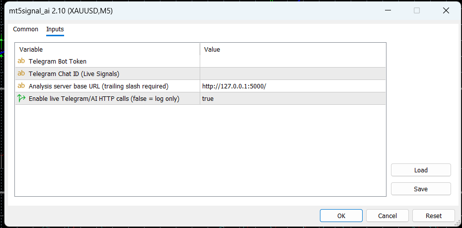
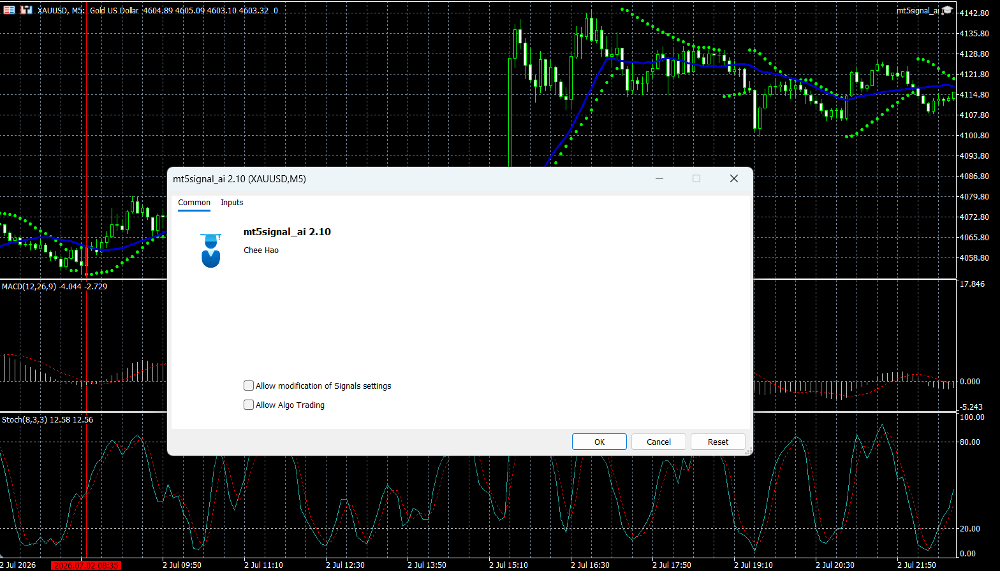
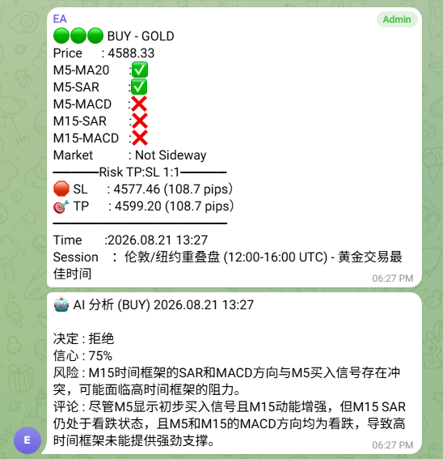
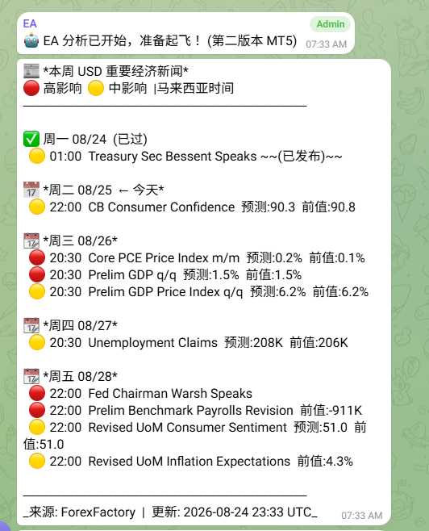
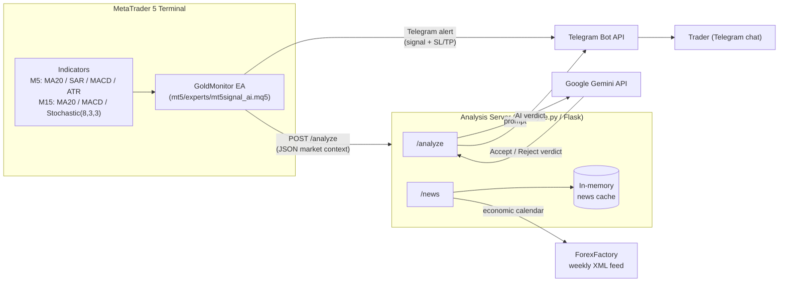

# MT5 AI Trading Signal System

An MT5 Expert Advisor that detects XAUUSD (Gold) M5 reversal signals (SAR flip on M5 + MA20 Trend on M5, Stochastic Indicator on M15), pushes alerts to Telegram, and forwards enriched market context — including MACD momentum on M5/M15, informational only — to a Python/Flask service that asks Google Gemini for a second opinion before the trade is acted on manually.

> **Note:** This EA is a *signal generator*, not an auto-trader — it never calls `OrderSend()`. Execution is manual, based on the Telegram alert and the AI's accept/reject verdict.

## Project Screenshots

**EA input parameters** — set when attaching the EA to a chart (Telegram bot token, chat ID, analysis server URL, news/AI-analyze toggles):



**EA running live on an XAUUSD M5 chart** — MA20 (blue line) and Parabolic SAR (green dots) driving signal detection, with MACD in the lower panel, alongside the EA's `Common` tab (name, author, algo-trading permissions):



**Real signal + AI verdict, end to end** — the raw Telegram alert (signal type, per-indicator ✅/❌ breakdown, session, SL/TP) immediately followed by Gemini's verdict. In this example the M5 signal fired, but the AI **rejected** it because the M15 timeframe's indicators disagreed with the M5 direction (screenshot predates the M15 SAR→Stochastic swap described below):



**Weekly economic news calendar** — the `/news` endpoint's USD high/medium-impact ForexFactory events, pushed to Telegram (`send_telegram=1`):



## Architecture



## Features

- **Multi-timeframe signal detection** — Parabolic SAR flip + MA20 trend filter on M5, confirmed by M15 Stochastic(8,3,3) trend direction (%K vs %D) before a signal fires, with MACD momentum context on M5 and M15.
- **Duplicate-signal guard** — tracks the last fired signal direction and the candle a SAR flip occurred on, to avoid repeat alerts within the same setup.
- **Sideway/ranging filter** — flags choppy conditions using 20-candle range and MA20 slope so weak setups are labeled accordingly.
- **Fixed 1:1 risk/reward SL & TP** — computed off the current SAR value with a pip buffer, with a minimum SL distance guard.
- **Telegram alerts** — bilingual (Chinese/English emoji-formatted) messages with session context (Tokyo/London/New York/overlaps).
- **AI second-opinion layer** — enriched market context (last 50 candles, candle body/wick %, breakout/wick-rejection counts, support/resistance) is sent to Gemini, which returns an accept/reject verdict, confidence, and risk note.
- **Economic news calendar** — `/news` endpoint pulls and caches USD high/medium-impact events from ForexFactory.
- **Backtest-safe** — all Telegram/HTTP calls are skipped automatically inside the MT5 Strategy Tester (`MQLInfoInteger(MQL_TESTER)`).

## Tech Stack

| Layer | Technology |
| :--- | :--- |
| Trading platform | MetaTrader 5 (MQL5 Expert Advisor) |
| Analysis service | Python 3, Flask |
| AI model | Google Gemini (`gemini-2.5-flash` via `google-genai`) |
| Notifications | Telegram Bot API |
| News data | ForexFactory weekly XML calendar |

## System Architecture

- **MT5 EA** (`mt5/experts/mt5signal_ai.mq5`) — runs on every tick, maintains indicator handles created once in `OnInit()`, computes M5/M15 indicator values via `CopyBuffer()`, and evaluates entry conditions.
- **Analysis server** (`ai/analyze.py`) — a single Flask process exposing `/analyze` (receives EA signals, builds an LLM prompt, calls Gemini, relays the verdict to Telegram) and `/news` (ForexFactory calendar, TTL-cached in memory).
- **Telegram** acts as the UI — both the raw signal alert and the AI's accept/reject verdict land in the same chat, and the trader executes manually in MT5.
- There is currently a single deployment target: the EA is configured to call the analysis server directly at a fixed LAN address/port (see [Configuration](#configuration)).

## Order Flow

No orders are placed automatically. The flow per tick is:

1. Read M5/M15 indicator buffers (M5: MA20, SAR, MACD, ATR; M15: MA20, MACD, Stochastic(8,3,3)) and price.
2. Check for a fresh SAR flip aligned with MA20 trend on M5, additionally confirmed by the M15 Stochastic trend (`m5Buy` requires M15 %K > %D / uptrend, `m5Sell` requires M15 %K < %D / downtrend).
3. If a new signal (different from `lastSignalType`) and the SL distance passes the minimum-distance guard, compute SL/TP (1:1 R:R).
4. Send the Telegram alert immediately.
5. Load the fuller `MarketContext` (last 50 candles, candle stats) and POST it to `/analyze`.
6. The trader receives both the raw signal and, moments later, the Gemini-generated accept/reject verdict, and decides whether to place the trade manually.

## Kafka Event Flow

Not used in this project. There is no message broker — the EA talks to the analysis server directly over HTTP (`WebRequest` → Flask), and results are relayed back to the user via the Telegram Bot API rather than an event stream.

## Database Design

Not used in this project. There is no persistent database:

- The EA's `MarketContext` struct exists only in memory for the duration of a signal.
- The analysis server keeps a single in-memory, TTL-based cache (`_news_cache`) for the ForexFactory calendar; nothing is written to disk.

If trade history/analytics tracking is needed later, see [Future Improvements](#future-improvements).

## Project Structure

```
MT5 Sys/
├── README.md
├── requirements.txt            # Python deps for ai/analyze.py
├── .env.example                # Template for the analysis server's required env vars
├── .gitignore
│
├── mt5/
│   └── experts/
│       └── mt5signal_ai.mq5    # MT5 Expert Advisor (signal detection + Telegram/AI dispatch)
│
└── ai/
    └── analyze.py              # Flask service: /analyze (Gemini verdict) and /news (ForexFactory calendar)
```

## Prerequisites

- MetaTrader 5 terminal with **Algo Trading** enabled.
- MT5 **Tools → Options → Expert Advisors** — the analysis server's URL and `https://api.telegram.org` must be added to the allowed **WebRequest** URL list, or all HTTP calls will silently fail.
- Python 3.10+ with dependencies from `requirements.txt` (`flask`, `requests`, `google-genai`).
- A Telegram bot token and chat ID (create a bot via [@BotFather](https://t.me/BotFather)).
- A Google Gemini API key.

## Getting Started

1. **Run the analysis server**

   macOS/Linux/Git Bash:
   ```bash
   pip install -r requirements.txt
   cp .env.example .env   # then fill in real values
   export $(grep -v '^#' .env | xargs)   # or use a tool like python-dotenv/direnv
   python ai/analyze.py
   ```

   Windows PowerShell:
   ```powershell
   pip install -r requirements.txt
   Copy-Item .env.example .env   # then fill in real values
   Get-Content .env | Where-Object { $_ -match '^[^#]' -and $_.Trim() -ne "" } | ForEach-Object {
       $name, $value = $_ -split "=", 2
       Set-Item -Path "Env:$name" -Value $value
   }
   python ai/analyze.py
   ```

   The server listens on `0.0.0.0:5000`.

2. **Install the EA**
   - Copy `mt5/experts/mt5signal_ai.mq5` into your MT5 `MQL5/Experts` folder.
   - Compile it in MetaEditor.
   - Attach it to an XAUUSD chart (M5) and fill in `InpBotToken`, `InpChatId`, and `InpServerBaseUrl` in the EA's **Inputs** tab (leave `InpEnableNews`/`InpEnableAiAnalyze` at their defaults, or disable either to skip that HTTP call).

3. **Whitelist URLs** in MT5 (see [Prerequisites](#prerequisites)) so `WebRequest` calls to Telegram and the analysis server succeed.

4. Watch the configured Telegram chat for signal alerts and the AI's follow-up verdict.

## Configuration

No secrets are hardcoded in source. Set them via EA inputs (MQL5) and environment variables (Python) before running.

**`mt5/experts/mt5signal_ai.mq5`** — set as EA **input parameters** when attaching to a chart:
| Input | Purpose |
|---|---|
| `InpBotToken` | Telegram bot token |
| `InpChatId` | Telegram chat/channel to post signals to |
| `InpServerBaseUrl` | Analysis server base URL, trailing slash required (default `http://127.0.0.1:5000/` — change to your own deployment; the EA appends `analyze` / `news?send_telegram=1`) |
| `InpEnableNews` | `true` = fetch/push the ForexFactory news summary to Telegram, `false` = log only (Experts log), no `/news` call |
| `InpEnableAiAnalyze` | `true` = POST signal context to `/analyze` for a Gemini verdict, `false` = log only (Experts log), no `/analyze` call |

`InpBotToken` and `InpChatId` default to empty strings — the EA won't send Telegram messages until you fill them in.

**`ai/analyze.py`** — set as environment variables before starting the server (see `.env.example`):
| Variable | Purpose |
|---|---|
| `TELEGRAM_BOT_TOKEN` / `TELEGRAM_CHAT_ID` / `TELEGRAM_CHAT_ID_TESTING` | Telegram credentials |
| `GEMINI_API_KEY` | Gemini API key |

The server raises `RuntimeError` at startup if any of these are missing, e.g.:
```bash
export TELEGRAM_BOT_TOKEN="..."
export TELEGRAM_CHAT_ID="..."
export TELEGRAM_CHAT_ID_TESTING="..."
export GEMINI_API_KEY="..."
python ai/analyze.py
```

⚠️ The token and key that were previously hardcoded in this repo's history should be considered compromised — rotate them (regenerate the Telegram bot token via [@BotFather](https://t.me/BotFather) and issue a new Gemini API key) rather than reusing the old values.

## API Documentation

### `GET /analyze`
Plain liveness check — no auth, no body. Returns `200 {"status": "ok", "message": "server running"}`. Useful for confirming the server is up before pointing the EA at it.

### `POST /analyze`
Called by the EA (`SendToExtForAI()` in `mt5signal_ai.mq5`) immediately after a signal fires, in parallel with the Telegram alert. Builds the Gemini prompt from this payload and relays the accept/reject verdict to Telegram — it does **not** return the verdict in the HTTP response (see below).

**Request body** (JSON) — this is the *exact* contract the EA sends and `analyze()` reads; keep this in sync with both `SendToExtForAI()` (MQL5) and the `data.get(...)` calls at the top of `analyze()` (Python) if either side changes:

```json
{
  "symbol": "XAUUSD",
  "timeframe": "M5",
  "time": "2026.08.22 09:43",
  "signal": "BUY",
  "price": 2412.35,
  "sl": 2410.85,
  "tp": 2413.85,
  "pips": 15.0,
  "spread": 0.00025,
  "volatility": 0.00185,
  "session": "London",
  "m5": {
    "ma20": 2411.20, "sar": 2410.60,
    "macd_main": 0.021500, "macd_sig": 0.018200, "macd_bull": true,
    "macd_hist": 0.003300, "macd_hist_dir": 1.0,
    "macd_hist_last5": [0.0005, 0.0012, 0.0021, 0.0028, 0.0033]
  },
  "m15": {
    "ma20": 2409.80,
    "macd_main": 0.045100, "macd_sig": 0.039800, "macd_bull": true,
    "macd_hist": 0.005300, "macd_hist_dir": 1.0,
    "macd_hist_last5": [0.0020, 0.0031, 0.0040, 0.0047, 0.0053],
    "stoch_main": 78.40, "stoch_sig": 65.10, "stoch_trend": "Uptrend"
  },
  "support_resistance": {
    "resistance_level": 2415.50, "support_level": 2405.20,
    "resistance_touch_count": 3, "support_touch_count": 2,
    "resistance_rejection_count": 1, "support_rejection_count": 0,
    "resistance_score": 9.0, "support_score": 4.0,
    "dist_to_resistance": 31.5, "dist_to_support": 71.5
  },
  "current_candle":  { "open": 2411.80, "high": 2412.50, "low": 2411.60, "close": 2412.35, "body_pct": 62.0, "wick_pct": 38.0 },
  "previous_candle": { "open": 2411.10, "high": 2411.95, "low": 2410.90, "close": 2411.80, "body_pct": 71.0, "wick_pct": 29.0 },
  "last_50_candles": {
    "hh_hl_count": 6, "lh_ll_count": 2,
    "range_high": 2416.00, "range_low": 2404.50, "range_size": 11.50,
    "atr_estimate": 0.00185, "big_candles": 4, "breakouts": 2, "wick_rejections": 3
  }
}
```

| Field group | Meaning |
| :--- | :--- |
| Top-level (`symbol`…`session`) | `timeframe` is always `"M5"` (M15 only appears nested under `m15`); `pips` is the SL→TP distance in pips (always equal since RR is fixed 1:1); `spread`/`volatility` are raw price units, not pips; `session` is one of Tokyo/London/New York/an overlap label from `GetSessionInfoEN()`. |
| `m5` / `m15` | Indicator snapshot per timeframe. `macd_bull` is `macd_main > macd_sig`. `macd_hist_dir` is `1.0` (rising) or `-1.0` (falling). `macd_hist_last5` is oldest→current, always 5 values. `m5` includes a `sar` field (M5 Parabolic SAR, used for signal timing); `m15` has no `sar` field (removed) but instead carries `stoch_main`/`stoch_sig` (M15 Stochastic(8,3,3) %K/%D) and `stoch_trend` (`"Uptrend"` if `stoch_main > stoch_sig`, else `"Downtrend"`) — this M15 Stochastic trend is also a hard entry filter enforced in the EA before `m5Buy`/`m5Sell` fire (see [Order Flow](#order-flow)), not just informational context for Gemini. |
| `support_resistance` | `resistance_level`/`support_level` are price levels derived from the last 50 M5 candles' high/low; `*_touch_count`/`*_rejection_count` count how many times price approached/bounced off that level; `*_score` is `touches*2 + rejections*3`; `dist_to_*` is in pips. |
| `current_candle` / `previous_candle` | OHLC of the signal candle and the one before it, plus body/wick as a percentage of the candle's total range. |
| `last_50_candles` | Trend/volatility summary over the lookback window used for the "market regime" judgment in the Gemini prompt — `hh_hl_count`/`lh_ll_count` are structure counts (higher-high/higher-low vs lower-high/lower-low), `atr_estimate` mirrors top-level `volatility`. |

**Response:** `200 {"status": "ok"}` on success — Gemini's 接受/拒绝 (accept/reject) verdict is pushed to Telegram, not returned in this response. On any failure (Gemini error, malformed body, etc.) it still responds `200 {"status": "error", "message": "..."}` rather than a 4xx/5xx, so the EA's `WebRequest` never sees an HTTP failure — that's a deliberate contract, not a bug (see [Reliability & Error Handling](#reliability--error-handling)).

### `GET /news`
Query params: `send_telegram=1` (optional) — also pushes the week's summary to Telegram.

Response:
```json
{ "status": "ok", "fetched_at": "...", "count": 0, "events": [ { "title": "...", "impact": "High|Medium", "date": "...", "time": "...", "forecast": "...", "previous": "..." } ] }
```
Backed by an hourly in-memory cache of the ForexFactory weekly XML calendar, filtered to USD High/Medium-impact events.

## Testing

- The EA checks `MQLInfoInteger(MQL_TESTER)` and skips all Telegram/HTTP calls in the MT5 **Strategy Tester**, printing to the Experts log instead — so strategy logic can be backtested without hitting live endpoints.
- There is no automated test suite for `ai/analyze.py` yet. Recommended next step: unit tests around the ForexFactory XML parsing (`_fetch_ff_xml`) and prompt formatting, and an integration test that stubs the Gemini client.

## Reliability & Error Handling

- **Telegram/Gemini calls never crash the request.** All outbound Telegram calls go through a single `_send_telegram()` helper with an explicit timeout (`HTTP_TIMEOUT = 10s`) that catches `requests.RequestException`, logs, and returns `False` instead of raising — so a Telegram outage can't take down `/analyze` or `/news`.
- **Gemini retry logic matches the actual SDK.** `call_gemini_with_retry()` retries on `google.genai.errors.ClientError` with `code == 429` (rate limit, exponential backoff) and on `ServerError` (transient 5xx), and re-raises immediately on anything else instead of retrying blindly.
- **Malformed input is rejected, not crashed on.** `/analyze` validates the JSON body with `request.get_json(silent=True)` and defaults every nested section (`m5`, `m15`, `support_resistance`, candle dicts) to `{}` so a partial or malformed EA payload can't raise an `AttributeError` mid-request.
- **Structured logging instead of `print`.** All server-side diagnostics go through the standard `logging` module (timestamped, leveled) rather than `print`, and unexpected exceptions are logged with full tracebacks via `logger.exception(...)`.
- **A global Flask error handler** catches anything unhandled and always returns `200 {"status": "error", ...}` rather than leaking a bare 500/stack trace to the EA, consistent with the "EA shouldn't log an HTTP failure" contract used elsewhere in `/analyze`.
- **MT5 EA side:** `OnInit()` now validates *every* indicator handle (including `handleMA20_M15` and `handleATR_M5`, previously unchecked) against `INVALID_HANDLE` before proceeding, and `WebRequest` failures in `SendTelegram()`/`SendToExtForAI()` are logged with `GetLastError()` and the HTTP status rather than assumed to succeed.

## Design Decisions

- **Manual execution over auto-trading** — the EA only signals and asks Gemini for a sanity check; the human stays in the loop for order placement.
- **Fixed 1:1 risk/reward** — SL and TP are always equidistant from entry, computed from the current SAR value plus a pip buffer, simplifying position sizing.
- **AI as a secondary filter, not a gate** — the Telegram alert and `/analyze` call both fire once M5 SAR-flip/MA20 conditions plus the M15 Stochastic trend confirmation are met; M15 MACD (still shown in the alert and payload) remains informational context passed to Gemini rather than an additional hard entry filter in the EA itself.
- **Independent news/AI kill switches** — `InpEnableNews` and `InpEnableAiAnalyze` are separate runtime `input bool`s checked with plain `if`s (replacing an earlier single `InpLiveMode` flag), so the trader can disable the ForexFactory news push and the Gemini AI-analyze call independently without touching the core Telegram signal alert, which always fires when live (outside the Strategy Tester).

## Future Improvements

- Decide whether M15 MACD alignment should also be an enforced entry filter (M15 Stochastic trend already is, as of the SAR→Stochastic swap on M15).
- Persist signals/AI verdicts/outcomes to a real datastore for win-rate and performance analytics.
- Containerize `ai/analyze.py` (Docker) for easier deployment instead of a fixed LAN IP.
- Add automated tests for the Flask service and a way to dry-run the EA's message formatting.

## Author

Foong Chee Hao

## License

MIT — see [LICENSE](LICENSE).
